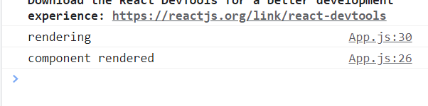
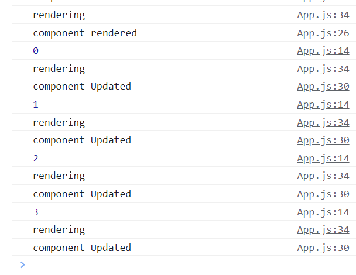

# 📖 React  기초


## React 시작하기


``` bash
npx create-react-app 프로젝트명
cd 프로젝트명
npm start
```


## Function 으로 인자전달

``` javascript
// Movie Component를  다른 컴포넌트에 사용하기
// 부모 App 에서 넘겨준 데이터를 받는 방법
function Movie(props) {
  console.log(props)
  return (
    <div>
      <h1>I Like {props.fav}</h1>
    </div>
  );
}

const LikeMovies = ['닥터 스트레인지', '범죄도시2', '해리포터', '쇼생크탈출']

// App Component 함수를 정의하고 안에 리턴값을 index.js로 넘겨준다.
function App() {
  return (
    <div className="App">
      <h1>Hello React!</h1>
      {/* 
        props를 이용하여 데이터를 보내는 방법
        주의 안에 데이터는 문자열을 제외한 나머지 데이터는 중괄호로 감싸야한다.
      */}
      {/* <Movie fav="Movie"/> */}
      {/* map을 사용하여 리스트 또는 딕셔너리를 출력하는 방법 */}
      {LikeMovies.map(movie => (
        <Movie fav={movie}/>
      ))}
    </div>
  );
}
```


## State로 동적인 값 부여하기


``` javascript
import React from "react";

// 직접 실행시키지않다고 초기값으로 실행되는 함수
class App extends React.Component {

  state = {
    cnt: 0,
  };
  // state에서 바로 데이터를 건들 수 없다. 
  add = () => {
    console.log(this.state.cnt)
    this.setState(current =>({
        cnt: current.cnt + 1
      }))
  };
  minus = () => {
    this.setState(current =>({
      cnt: current.cnt - 1
    }))
  }

  render() {
    return (
      <div>
        <h1>I'm class component</h1>
        <h2>Count : { this.state.cnt }</h2>
        <button onClick={this.add} >add</button>
        <button onClick={this.minus}>minus</button>
      </div>
    );
  }
}

export default App;
```


## componentDidMount( ) 함수

실행순서

```
constructor( ) => render( ) => componentDidMount( )
```





## componentDidUpdate( ) 함수

```
setState()  => render() =>  componentDidUpdate()
```





``` javascript
import React from "react";
// 직접 실행시키지않다고 초기값으로 실행되는 함수
class App extends React.Component {

  state = {
    cnt: 0,
  };
  // state에서 바로 데이터를 건들 수 없다. 
  add = () => {
    console.log(this.state.cnt)
    this.setState(current =>({
        cnt: current.cnt + 1
      }))
  };
  minus = () => {
    this.setState(current =>({
      cnt: current.cnt - 1
    }))
  }

  componentDidMount(){
    console.log('component rendered')
  }

  componentDidUpdate(){
    console.log('component Updated')
  }

  render() {
    console.log('rendering')
    return (
      <div>
        <h1>I'm class component</h1>
        <h2>Count : { this.state.cnt }</h2>
        <button onClick={this.add} >add</button>
        <button onClick={this.minus}>minus</button>
      </div>
    );
  }
}
export default App;
```


