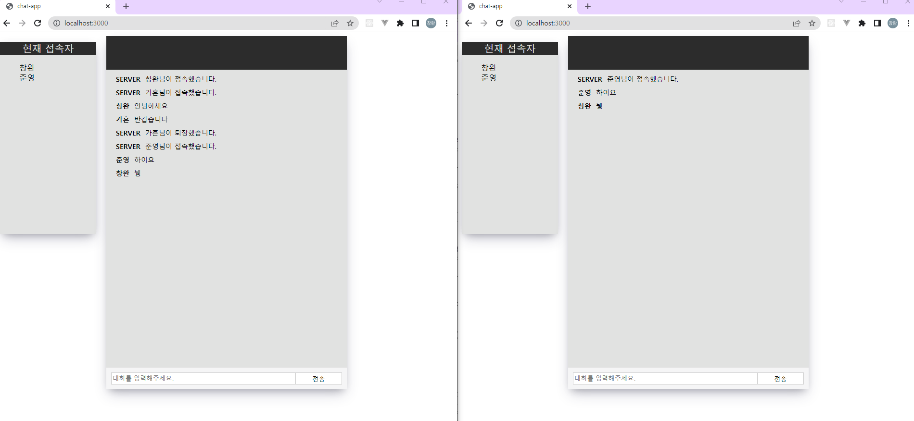
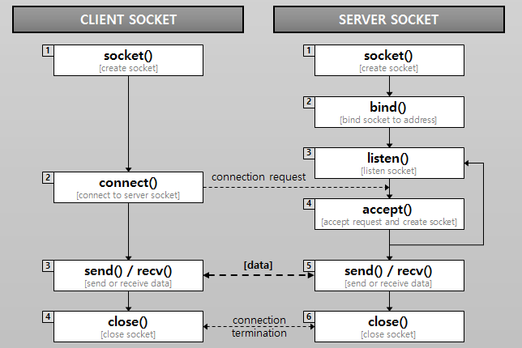

# node.js-Chat_Server-Client 구현


## 1 .실행 결과





## 2.배운점

```
소켓의 구동원리를 이해하는데 도움이 많이 되었습니다.

클라이언트 소켓(Client Socket)은 처음 소켓(Socket)을 생성(create)한 다음, 서버 측에 연결(connect)을 요청합니다. 그리고 서버 소켓에서 연결이 받아들여지면 데이터를 송수신(send/recv)하고, 모든 처리가 완료되면 소켓(Socket)을 닫습니다(close).
서버 소켓(Server Socket)은 처리 과정이 조금 복잡합니다. 일단 클라이언트와 마찬가지로, 첫 번째 단계는 소켓(Socket)을 생성(create)하는 것입니다. 그리고 서버 소켓이 해야 할 두 번째 작업은, 서버가 사용할 IP 주소와 포트 번호를 생성한 소켓에 결합(bind)시키는 것입니다. 그런 다음 클라이언트로부터 연결 요청이 수신되는지 주시(listen)하고, 요청이 수신되면 요청을 받아들여(accept) 데이터 통신을 위한 소켓을 생성합니다. 일단 새로운 소켓을 통해 연결이 수립(ESTABLISHED)되면, 클라이언트와 마찬가지로 데이터를 송수신(send/recv)할 수 있습니다. 마지막으로 데이터 송수신이 완료되면, 소켓(Socket)을 닫습니다(close).
```



